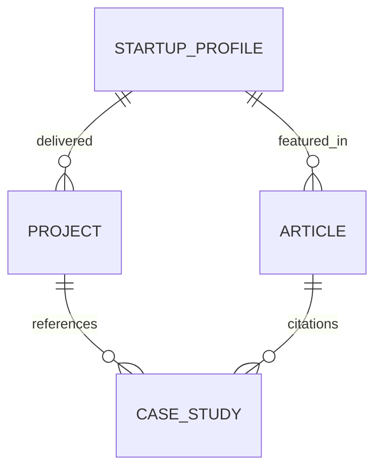

# Content Model Architecture

**Project:** BirruLabs Official Website  
**Entities:** Project, Article, CaseStudy, StartupProfile, Page

---

## Overview

DSDL (Data Schema Definition Language) for content management. Primary CMS: Sanity.io or custom Next.js API.

---

## Core Entity Schema

### 1. Project (Proyek)

**Purpose:** Showcase technical capabilities and delivery history

**Fields:**

```typescript
interface Project {
  // Identifiers
  _id: string;                    // Sanity document ID
  slug: { current: string };      // URL-friendly ID
  
  // Metadata
  category: 'ai' | 'automation' | 'agents' | 'custom';
  tags: string[];
  featured: boolean;
  
  // Localization (bilingual)
  id: ProjectLocalization;
  en: ProjectLocalization;
  
  // Content
  client?: string;                // Client name (or "Confidential")
  projectDate: string;            // ISO date
  duration: string;               // e.g., "3 months"
  
  // Media
  heroImage?: Image;
  gallery: Image[];
  demoVideo?: string;             // YouTube/Vimeo URL
  
  // Body content
  summary: PortableText;
  challenges: PortableText[];
  solutions: PortableText[];
  results: PortableText[];
}
```

**ProjectLocalization:**
```typescript
interface ProjectLocalization {
  title: string;
  subtitle?: string;
  overview: PortableText;
  technicalStack: string[];       // e.g., ["Next.js", "OpenAI API", "Redis"]
  teamSize: number;
  financiallyStructured: boolean; // Visible to partners only
}
```

**Validation Rules:**
- `title`: Required, max 100 chars
- `slug`: Auto-generated from title
- `featured`: Only 3 projects can be featured per language
- `category`:至少 1 required

---

### 2. Article (Artikel)

**Purpose:** Content marketing, SEO, thought leadership

**Fields:**

```typescript
interface Article {
  _id: string;
  slug: { current: string };
  
  // Metadata
  type: 'blog' | 'tutorial' | 'case-study' | 'news';
  category: string;
  tags: string[];
  featured: boolean;
  
  // Author
  author: Reference to Author;
  publishedAt: string;
  updatedAt?: string;
  
  // Localization
  id: ArticleLocalization;
  en: ArticleLocalization;
  
  // SEO
  seoTitle: string;
  seoDescription: string;
  ogImage?: Image;
}
```

**ArticleLocalization:**
```typescript
interface ArticleLocalization {
  title: string;
  excerpt: string;
  content: PortableText;          // Rich text with embedded media
  readTime: number;               // Auto-calculated
}
```

**Content Types:**
- **Blog:** Informal, opinionated, product announcements
- **Tutorial:** Step-by-step technical guide
- **Case Study:** Client success story (cross-reference CaseStudy entity)
- **News:** Press releases, partnerships

---

### 3. CaseStudy (Studi Kasus)

**Purpose:** Detailed client success documentation

**Fields:**

```typescript
interface CaseStudy {
  _id: string;
  slug: { current: string };
  
  // Metadata
  industry: string;               // e.g., "Fintech", "Edutech"
  focus: 'automation' | 'ai' | 'integration';
  clientLogo?: Image;
  
  // Localization
  id: CaseStudyLocalization;
  en: CaseStudyLocalization;
  
  // Metrics (anonymized if needed)
  keyMetrics: Metric[];
  
  // Content
  executiveSummary: PortableText;
  problemStatement: PortableText;
  solutionApproach: PortableText;
  implementation: PortableText;
  outcomes: PortableText;
}
```

**CaseStudyLocalization:**
```typescript
interface CaseStudyLocalization {
  title: string;
  subtitle: string;
  overview: PortableText;
}
```

**Metric Schema:**
```typescript
interface Metric {
  label: string;
  value: string;
  unit?: 'percent' | 'currency' | 'number';
  timeframe: string;              // e.g., "3 months"
}
```

---

### 4. StartupProfile (Profil Startup)

**Purpose:** Showcase Grace/accelerator portfolio companies

**Fields:**

```typescript
interface StartupProfile {
  _id: string;
  slug: { current: string };
  
  // startups program metadata
  program: 'akcelera-id' | 'birrulabs-club' | 'helostech';
  cohort: string;                 // e.g., "2025-Q1"
  status: 'active' | 'graduated' | 'shutdown';
  
  // Company info
  companyName: string;
  tagline: PortableText;
  description: PortableText;
  logo?: Image;
  website?: string;
  linkedin?: string;
  twitter?: string;
  
  // Domain/Industry
  industry: string;
  stage: 'seed' | ' Series A' | 'Series B';
  geolocation: string;
  
  // Team (up to 5)
  founders: Founder[];
  
  // Tech Stack
  techStack: string[];
  
  // Results
  fundingRaised?: string;
  keyMilestones: Milestone[];
}
```

**Founder Schema:**
```typescript
interface Founder {
  name: string;
  role: string;
  linkedin?: string;
  photo?: Image;
}
```

**Milestone Schema:**
```typescript
interface Milestone {
  title: string;
  date: string;
  description: string;
}
```

---

### 5. Page

**Purpose:** Static pages (About, Contact, Terms, Privacy)

**Fields:**

```typescript
interface Page {
  _id: string;
  slug: { current: string };
  
  // Metadata
  title: string;
  showInNavigation: boolean;
  navOrder?: number;
  
  // Localization
  id: PageLocalization;
  en: PageLocalization;
  
  // SEO
  seoTitle: string;
  seoDescription: string;
}
```

**PageLocalization:**
```typescript
interface PageLocalization {
  body: PortableText;
  ctaSection?: PortableText;
}
```

---

## Content Relationships

### Entity References



### Cross-Linking Rules

| Entity | Links To | Max Count |
|--------|----------|-----------|
| Project | CaseStudy, Article | 5 |
| Article | Project, StartupProfile | 10 |
| CaseStudy | Project, Article, StartupProfile | 3 |
| StartupProfile | Project, Article | 5 |

---

## Content Relationships in细致

### Project → CaseStudy
- One project can spawn multiple case studies (different angles)
- Each case study references the parent project

### Article → StartupProfile
- Articles can feature startups without being case studies
- Startup profile pages list related articles

### CaseStudy → All Entities
- Case study bridges project delivery to client results
- CTA links to relevant project, related articles, startup profile

---

## Content Annotations

### Status Workflow

```
Draft → In Review → Published → Deprecated → Archived
```

| Status | Visible | Editable |
|--------|---------|----------|
| Draft | No | Yes (author only) |
| In Review | No | Yes (editorial team) |
| Published | Yes | Yes (editorial team) |
| Deprecated | Yes | No |
| Archived | No | No (read-only) |

### Localization Status

```typescript
type LocalizationStatus = 'draft' | 'in-progress' | 'review' | 'published';

interface LocalizedContent {
  id: { status: 'published' | 'draft'; ... };
  en: { status: 'published' | 'draft'; ... };
}
```

---

## Content Access Control

### Role-Based Permissions

| Role | Project | Article | CaseStudy | StartupProfile |
|------|---------|---------|-----------|
| Admin | Full | Full | Full | Full |
| Editor | Edit own | Edit own | Edit own | View only |
| Author | Create own | Create own | Create case study | View only |
| Partner | View (redacted) | View | View | View |
| Client | View own projects | View | View case studies | View only |

---

## Content Query Patterns

### Projects by Category
```typescript
const projectsByCategory = async (category: string, lang: 'id' | 'en') => {
  const query = `
    *[_type == "project" && category == $category] | order(publishedAt desc) {
      "title": ${lang}.title,
      "slug": slug.current,
      featured
    }
  `;
  return client.fetch(query, { category });
};
```

### Case Studies by Startup
```typescript
const caseStudiesByStartup = async (startupId: string) => {
  const query = `
    *[_type == "casestudy" && references($startupId)] {
      "title": id.title,
      slug,
      keyMetrics
    }
  `;
  return client.fetch(query, { startupId });
};
```

### Recommended Articles
```typescript
const getRecommendedArticles = async (tags: string[], excludeId: string) => {
  const query = `
    *[_type == "article" && _id != $excludeId && tags in $tags] | order(publishedAt desc) [0..3] {
      "title": id.title,
      "slug": slug.current,
      excerpt
    }
  `;
  return client.fetch(query, { tags, excludeId });
};
```

---

## SEO & URL Strategy

### Project URLs
```
ID:  /id/projects/[slug]
EN:  /en/projects/[slug]
```

### Article URLs
```
ID:  /id/artikel/[slug]
EN:  /en/articles/[slug]
```

### Case Study URLs
```
ID:  /id/casestudy/[slug]
EN:  /en/casestudy/[slug]
```

### Startup Profile URLs
```
ID:  /id/startup-profile/[slug]
EN:  /en/startup-profile/[slug]
```

---

## Content Licensing

| Entity | License | Copyright Holder |
|--------|---------|------------------|
| Project | Proprietary | BirruLabs (client NDA) |
| Article | CC BY-NC-SA 4.0 | BirruLabs |
| CaseStudy | Proprietary | BirruLabs (client agreement) |
| StartupProfile | Public domain | Startup owner (with permission) |

---

## Content Coverage Checklist

### Homepage Must-Have
- [ ] Featured project (max 3 languages × 1)
- [ ] Latest article (max 1)
- [ ] Active startup profile (max 2)
- [ ] Contact CTA

### Project Detail Page Must-Have
- [ ] Hero image
- [ ] Client name (or confidential)
- [ ] Technical stack badges
- [ ] Key metrics
- [ ] Case study linkage
- [ ] Contact CTA

### Article Detail Page Must-Have
- [ ] Author bio
- [ ] Published date
- [ ] Read time
- [ ] Share buttons
- [ ] Related articles
- [ ] Newsletter signup

---

## Content Growth Plan

### Phase 1 (Launch)
- 5 Projects (2 ID, 2 EN, 1 bilingual)
- 10 Articles (5 ID, 5 EN)
- 3 Case Studies (bilingual)
- 3 Startup Profiles (bilingual)

### Phase 2 (6 months)
- 15 Projects
- 30 Articles
- 8 Case Studies
- 8 Startup Profiles

### Phase 3 (12 months)
- 30 Projects
- 60 Articles
- 15 Case Studies
- 15 Startup Profiles

---

## Content Maintenance

### Refresh Cycles
| Entity | Refresh Frequency |
|--------|-------------------|
| Project | Quarterly (status updates) |
| Article | Monthly (new content) |
| CaseStudy | Quarterly (new metrics) |
| StartupProfile | Bi-annually (funding updates) |

### Audit Checklist
- [ ] Broken links (monthly)
- [] Open graph images (before sharing)
- [] Alt text completeness (quarterly)
- [] translations completeness (after major updates)
